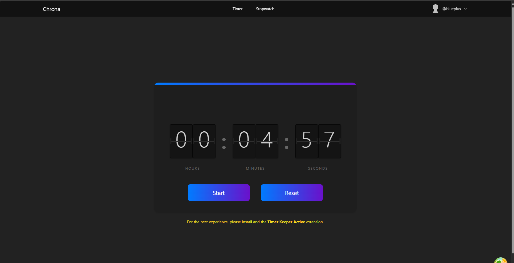

# 🕒 Chrona Frontend

Chrona is a modern, high-precision countdown timer application built with **React**, **Vite**, and **TailwindCSS**. Designed for reliability and seamless UX, it empowers users to start, pause, reset, and persist countdowns across browser sessions, even after refreshes or device sleep.

Chrona integrates tightly with backend APIs and optionally leverages the **Timer Keeper** Chrome extension for enhanced background performance on modern browsers.

---

## ✨ Key Features

- **Real-Time Countdown**: Responsive countdown with start, pause, and reset functionality.
- **Persistent Timer State**: Countdown remains accurate across refreshes via backend synchronization.
- **Extension-Aware Optimization**: Detects and utilizes Timer Keeper for background throttling prevention.
- **Responsive & Accessible**: Mobile-first, fully responsive design with high accessibility standards.
- **Production-Ready SPA**: Built as a single-page application (SPA) using Vite + React.
- **Professional UI/UX**: Elegant animations, smooth transitions, and optimized dark mode.

---

---

## 📊 Technologies Used

- **React 19** (Functional components, Hooks)
- **Vite** (Lightning-fast build tooling)
- **TypeScript** (Full type safety)
- **TailwindCSS** (Utility-first styling)
- **React Query** (Server-state management)
- **Axios** (HTTP requests)
- **Radix UI** (Accessible components)
- **Custom Browser Extension Integration** (Timer Keeper)
- **Azure Container Apps** (Dockerized SPA deployment)
- **Vercel / Netlify** (Static hosting)
- **GitHub Actions** (CI/CD pipelines)

---

## 🔄 Live Demo

- **Production**: [https://chrona.blueprime.app](https://chrona.blueprime.app)
- **Staging**: [https://staging-timer-app-slim.azurewebsites.net](https://staging-timer-app-slim.azurewebsites.net)

---


## 🔹 Core Project Structure

```shell
/src
  /components    # Reusable UI components
  /pages         # Main pages (Countdown, Stopwatch)
  /hooks         # Custom React hooks (Timer logic, Extension detection)
  /api           # API layer (Axios clients)
  /lib           # Utilities and helpers
  /assets        # Static assets (images, icons)
  /constants     # Global constants
```

---

## 🚫 Optional Chrome Extension

For enhanced background performance (prevent tab throttling and sleep):

- **Timer Keeper** Chrome Extension
    - [GitHub](https://github.com/miracle5284/timer-keeper-extension)
    - [Chrome Web Store](https://chromewebstore.google.com/detail/jndhblddppbjacboankdagkmbnnmpbdf)

The extension automatically optimizes performance when using Chrona.

---

## 💡 Contributing

Contributions are welcome! Feel free to open issues.

---

## 🌟 License

This project is licensed under the [License](./LICENSE.md).

---

## 📈 Related Projects

- **Chrona Backend**: [chrona-backend](https://github.com/miracle5284/chrona-backend)
- **Timer Keeper Chrome Extension**: [timer-keeper-extension](https://github.com/miracle5284/timer-keeper-extension)

---

## 🚀 About the Author

Built with passion by [Miracle Adebunmi](https://github.com/miracle5284).

---

**Every second counts. Chrona makes sure you never lose a moment.**

